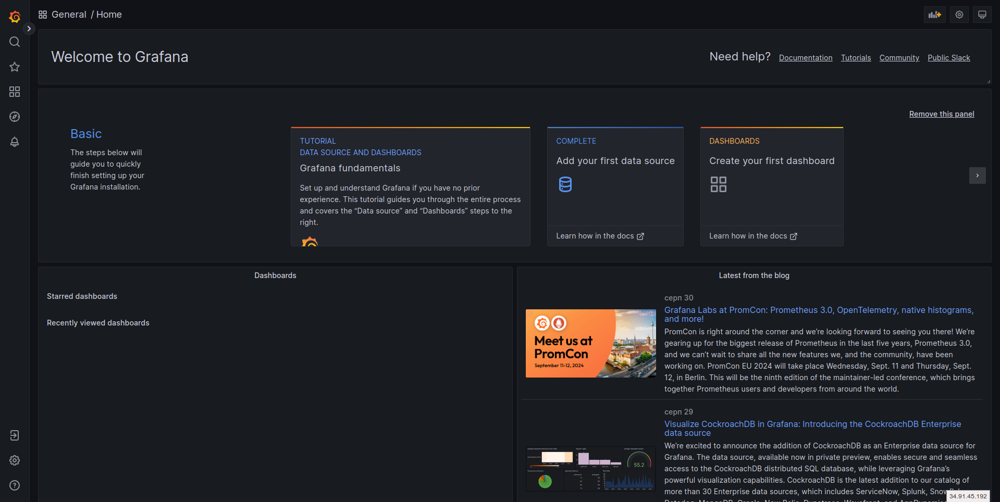
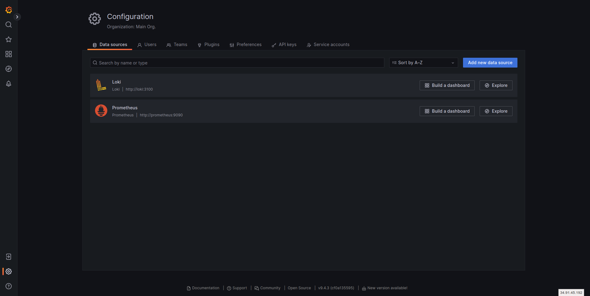
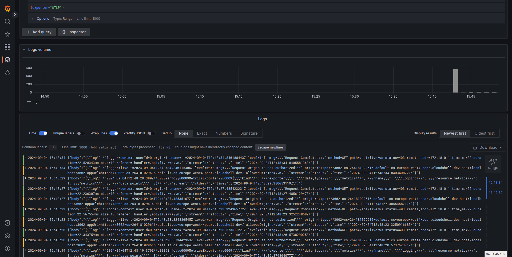
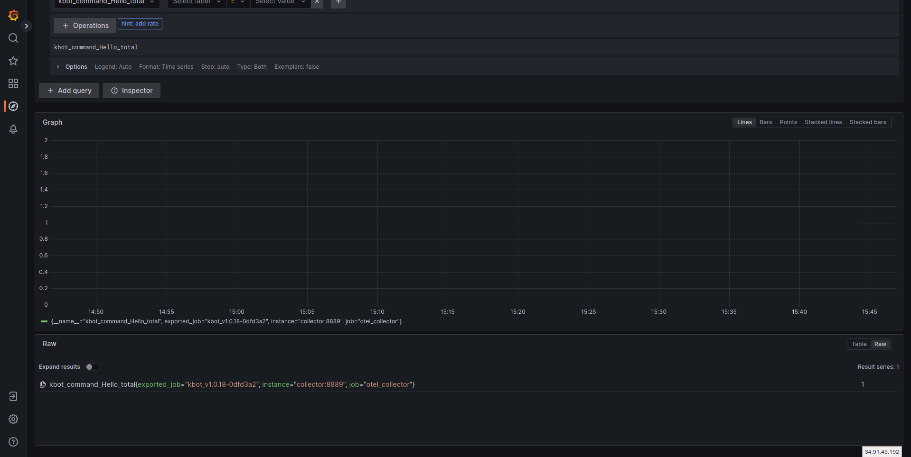

# Розгортання стеку моніторингу Grafana для демо-застосунку за допомогою docker-compose

## Процес розгортання та інструментування коду

1. Клонуємо цей репозиторій з необхідними компонентами 
```bash
git clone https://github.com/YuriiKosiy/kbot
cd kbot
```
Компоненти та налаштування розгортання docker-compose знаходяться в папці `otel`.
де,
 * Налаштування `Loki` представлені у:
   - otel/loki/loki-local-config.yaml - описує налаштування Loki для системи журналювання, розроблена компанією Grafana Labs.
 * Збір логів здійснюється за допомогою `Fluent Bit` — це легкий, високоефективний інструмент для збору, обробки та доставки журналів (логів)
 - otel/fluent-bit/fluent-bit.conf - конфігурація
 - otel/fluent-bit/docker-metadata.lua - використовується в Fluent Bit для збору додаткових метаданих з Docker контейнерів і додавання цих метаданих до логів.
 * Візуалізація даних здійснюється за допомогою `Grafana`:
 - otel/grafana/grafana-datasources.yaml - файл де ми описуємо звідки брати дані для візуалізації.
 * описуємо конфігурацію `OpenTelemetry Collector`, який використовується для збору, обробки та експорту метрик, логів і трас (трейсів):
 - otel/collector/otel-collector-contrib.yaml
 * Конфігурація `Prometheus` для збору метрик. Prometheus — це популярна система моніторингу і збору метрик, розроблена з акцентом на масштабованість, надійність і можливість відстежувати роботу додатків та інфраструктури в реальному часі.
 - otel/prometheus/prometheus.yaml

 * основний наш файл Docker Compose який налаштовує кілька сервісів для збору (які ми підготували вище), обробки та візуалізації логів, метрик і трас.
 - otel/docker-compose.yaml


2. Готуємо змінну середовища з токенами та ключами API для роботи бота:
так як наш бот використовує TELE_TOKEN та openweather_api_key їх потрібно додати у вашу сесію
```bash
export TELE_TOKEN={ваш телеграм токен}
export openweather_api_key={ваш API OpenWeather}
```

3. Розгортаємо налаштовані компоненти як описані в `docker-compose.yaml`:
```bash
docker-compose -f otel/docker-compose.yaml up
```

4. Інтерфейс системи моніторингу знаходиться за адресою http://localhost:3000

Перший екран при вході 
 

Перевіряємо чи в нас працюють Loki та Prometheus
 

Заходимо в Explore та перевіряємо чи є наші логи. Попередньо в бот надсилаємо різні запити.

Логи Loki
 

Логи Prometheus
